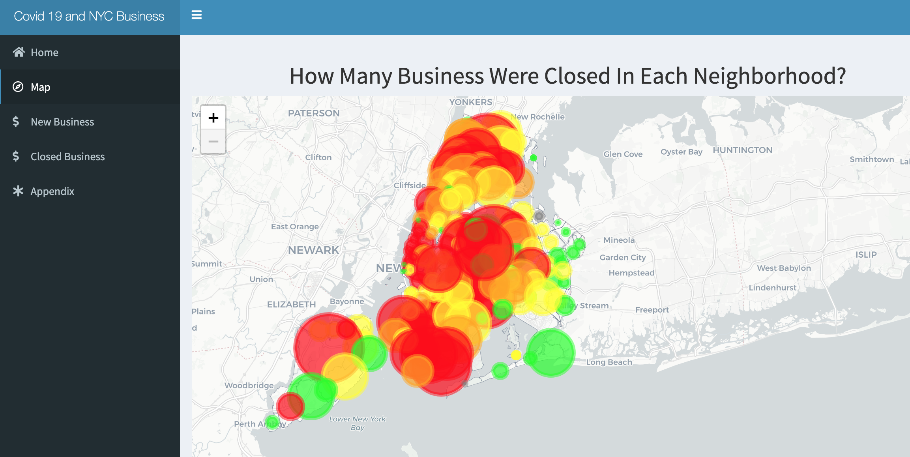
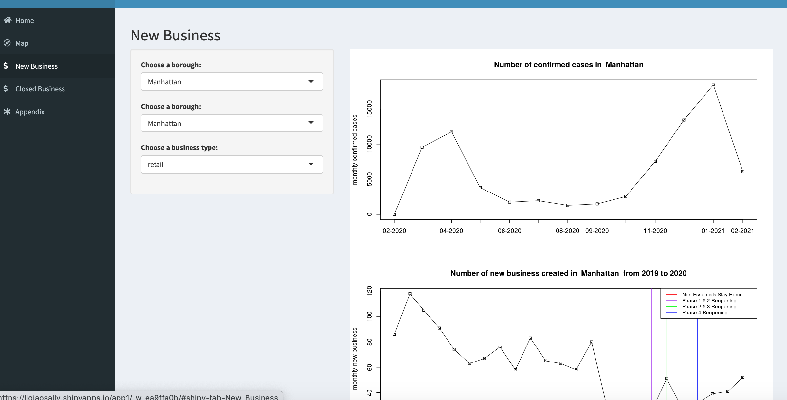
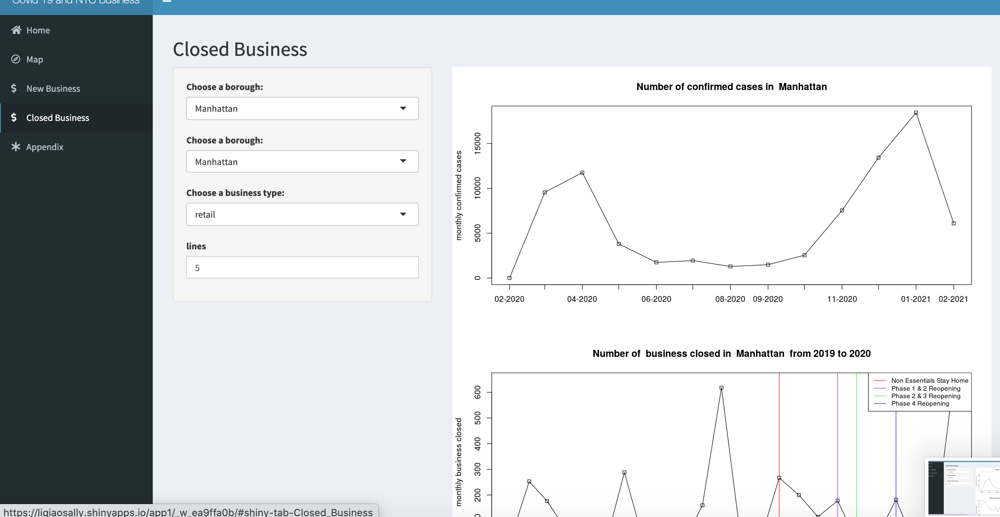

# Project 2: Shiny App Development

### [Project Description](doc/project2_desc.md)






We develop a *Exploratory Data Analysis and Visualization* shiny app on a topic NYC Health open data released on the [NYC Coronavirus Disease 2019 Data](https://github.com/nychealth/coronavirus-data) website. See [Project 2 Description](doc/project2_desc.md) for more details.  

The **learning goals** for this project is:

- business intelligence for data science
- study legacy codes and further development
- data cleaning
- data visualization
- systems development/design life cycle
- shiny app/shiny server

*The above general statement about project 2 can be removed once you are finished with your project. It is optional.

## Project Title: Covid 19 and the Impacts on NYC Business
Term: Spring 2021

+ Team #
+ **Projec title**: + Team members
	+ Wendy Doan
	+ Qizhen Yang
	+ Qiao Li
	+ Yandong Xiong
	+ James Smiley

+ **Project summary**: 
+ Drawing data from multiple sources, this application provides insight into the economic impact of coronavirus 2019 (COVID-19) on New York’s city economy. The results shed light on both the financial fragility of many businesses, and the significant impact COVID-19 had on these businesses in the weeks after the COVID-19–related disruptions began.
+ The application will mainly track down the change in the number of businesses being closed or newly opened across Covid timeline. We divided the businesses into 4 types: Retail, Service, Food and Beverage, Entertainment


+ **Contribution statement**: ([default](doc/a_note_on_contributions.md)) 
+ Wendy, Qizhen, Yandong and Qiao designed the study. 
+ Wendy contributes to the Home, Map and Appendix page in the App. 
+ Yandong contributes to the graphs on the number of new business created in NYC and different borough. 
+ Qiao contributes to the graphs on the number of business closed in NYC and different borough. 
+ Qizhen contributes to the graphs on the monthly confirmed cases in different borough in NYC and plan the group meeting.
+ Wendy, Yandong, Qiao, Qizhen helps each other to debug the codes.
+ James presents the projects only. 

Following [suggestions](http://nicercode.github.io/blog/2013-04-05-projects/) by [RICH FITZJOHN](http://nicercode.github.io/about/#Team) (@richfitz). This folder is orgarnized as follows.

```
proj/
├── app/
├── lib/
├── data/
├── doc/
└── output/
```

Please see each subfolder for a README file.

